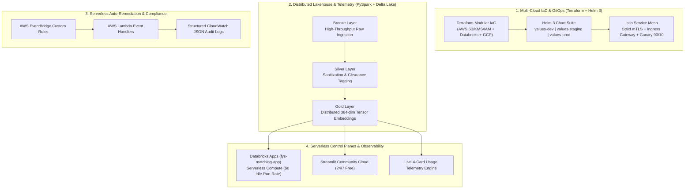

# William Free Hall (Free)
### Principal Cloud & AI Architect • DevSecOps Lead • Databricks SME
**Niceville, FL** • [LinkedIn](https://linkedin.com/in/william-free-hall) • [GitHub Enterprise](https://github.com/For-Your-Service) • Email: [whall4.wh@gmail.com](mailto:whall4.wh@gmail.com)

---

## 🎯 Executive Summary

Principal Cloud & AI Architect, DevSecOps Lead, and Technical Leader with over 20 years of experience transitioning high-stakes operational leadership into architecting resilient, multi-cloud enterprise lakehouse environments and zero-trust microservice meshes across **AWS, GCP, Databricks, and Kubernetes**.

Veteran U.S. Army Special Forces Intelligence Sergeant (18F) and Team Sergeant (18Z) combining elite operational discipline with deep technical execution in **high-throughput PySpark data pipelines, Delta Lake Medallion architectures, modular Terraform IaC, Istio strict mTLS zero-trust meshes, and automated CI/CD governance**.

---

## 🏛️ Flagship Enterprise Architecture Showcase

---

## 🚀 Pinned Flagship Projects

### 1. [For Your Service — Enterprise Lakehouse & Neural Vector Matching Engine](https://github.com/For-Your-Service/For-Your-Service)
* **Core Problem:** Military service records and combat/technical leadership sit in unstructured PDFs that civilian ATS filters reject.
* **Architectural Solution:**
  * **Lakehouse Medallion Pipeline:** Distributed PySpark and Delta Lake engine parsing raw operational payloads into structured Silver records and Gold vector embeddings (`@pandas_udf` with `all-MiniLM-L6-v2`).
  * **Databricks Unity Catalog:** Enforces automated column-level lineage, fine-grained RBAC/ABAC security, and multi-tenant isolation.
  * **Serverless Control Plane:** Live Streamlit matching application deployed serverless on Databricks Apps with dynamic proxy routing (`$DATABRICKS_APP_PORT`).
  * **Zero-Cost Edge Offload:** Offloaded heavy scraping and initial ETL to local Omarchy Linux edge nodes (14-core Intel CPU / RTX 4050) to run cloud lakehouse infrastructure at $0.00 idle cost.
* **Live Deployment:** [fys-matching-app on Databricks](https://fys-matching-app-7474643734871839.aws.databricksapps.com)

---

### 2. [Enterprise Multi-Cloud GitOps & Zero-Trust Pipeline](https://github.com/FreeFades2Black/enterprise-multicloud-gitops-zerotrust)
* **Core Problem:** Multi-cloud Kubernetes clusters across AWS and GCP suffer from configuration drift, static credential leakage, and late-stage CIS compliance failures.
* **Architectural Solution:**
  * **Modular Terraform IaC:** Reusable multi-cloud provisioning with S3/DynamoDB remote state locking.
  * **HashiCorp Vault & Cloud KMS:** Dynamic, short-lived tokens eliminating static Kubernetes secret exposure.
  * **ArgoCD Declarative GitOps:** Automated pull-based cluster synchronization with self-healing reconciliation.
  * **Policy-as-Code Gatekeeper:** OPA (Open Policy Agent) and Conftest enforcing CIS Kubernetes and Terraform benchmarks in CI/CD.

---

### 3. [Serverless Cloud Incident Auto-Remediation & Compliance Engine](https://github.com/FreeFades2Black/serverless-cloud-autoremediation-engine)
* **Core Problem:** Configuration drift and accidental public exposure in cloud accounts create dangerous vulnerability windows when relying on slow 24-hour compliance scans.
* **Architectural Solution:**
  * **Sub-Second Event-Driven Remediation:** Intercepts CloudTrail mutations via AWS EventBridge and executes least-privilege AWS Lambda handlers in < 1.2 seconds.
  * **Automated Security Controls:** Instant `PutPublicAccessBlock` enforcement on S3, automatic revocation of `0.0.0.0/0` ingress on ports 22/3389, and unencrypted EBS volume tagging.
  * **Audit Logging & Alerting:** Generates structured CloudWatch JSON audit trails and formatted Slack/Teams security alerts.

---

### 4. [Universal Resume Normalization & ATS Extraction Pipeline](https://github.com/FreeFades2Black/universal-resume-pipeline)
* **Core Problem:** Unstructured resumes across PDF/DOCX formats suffer from multi-column parsing failures, keyword stripping, and manual re-entry across ATS portals (Greenhouse, Lever, Workday).
* **Architectural Solution:**
  * **Schema-Enforced Normalization:** Robust extraction engine utilizing Pydantic schemas to validate and normalize arbitrary technical resumes into standard JSON.
  * **Zero-Cost Parsing Engine:** 100% local, offline extraction (`pypdf`, `python-docx`) without recurring third-party LLM API dependencies.
  * **Automated Test Coverage:** Comprehensive pytest test suite validating email, phone, security clearance, and skill extraction accuracy.

---

### 5. [Omarchy Linux Antigravity Bootstrap & System Provenance Engine](https://github.com/FreeFades2Black/omarchy-antigravity-bootstrap)
* **Core Problem:** Setting up low-latency, hardened Linux development workstations with automated agentic AI workflows and system health healing is time-consuming and fragile.
* **Architectural Solution:**
  * **305-Commit Automated Toolchain:** Complete step-by-step automation provisioning Arch Linux on ASUS ROG Flow Z13 convertible hardware.
  * **System Healing & Optimization:** Automated systemd-resolved DNS recovery, 8GB swapfile allocation, weekly NVMe SSD TRIM scheduling (`fstrim.timer`), and glassmorphic Hyprland UI orchestration.
  * **Autonomous AI Integration:** Native deployment of Google Antigravity (`agy`) with global hotkey (<kbd>Super</kbd> + <kbd>A</kbd>) and encrypted SSH pair-programming orchestration.

---

## 🛠️ Core Competencies & Technical Stack

| Domain | Technologies & Frameworks |
| :--- | :--- |
| **Cloud & Lakehouse Platforms** | Databricks Lakehouse, Delta Lake, Unity Catalog, AWS (S3, Lambda, EventBridge, IAM, KMS), GCP (GKE, BigQuery, GCS), Azure |
| **DevSecOps & Orchestration** | Kubernetes (EKS/GKE), Helm 3, Istio Service Mesh, ArgoCD, Docker, Terraform / OpenTofu, HashiCorp Vault, GitHub Actions |
| **Data Engineering & Streaming** | Apache Spark, PySpark, Auto Loader, Structured Streaming, Change Data Feed (CDC), Pandas UDFs, Delta Sharing |
| **Security & Compliance** | Zero-Trust Architecture, Strict mTLS, Open Policy Agent (OPA), Conftest, Trivy, IAM Least-Privilege, CIS Benchmarks |
| **Languages & Toolchains** | Python 3.11/3.12/3.14, SQL, Bash / Shell, PowerShell, REST APIs, FastAPI, Streamlit, Git |

---

## 📜 Education & Certifications

* **Bachelor of Science in Cybersecurity** — American Military University (2022)
* **Associate of Arts in Computer Programming Specialist** — Northwest Florida State College
* **AWS Certified Cloud Practitioner** — Amazon Web Services
* **AWS DevOps Accelerator Program** — SkillStorm / AWS Professional Track
* **Microsoft Certified: Azure Fundamentals (AZ-900)** — Microsoft
* **Special Forces Intelligence Sergeant Course (18F)** — U.S. Army Special Operations Center of Excellence
* **Special Forces Advanced Reconnaissance, Target Analysis, and Exploitation (SFARTAETC)** — U.S. Army Special Operations
