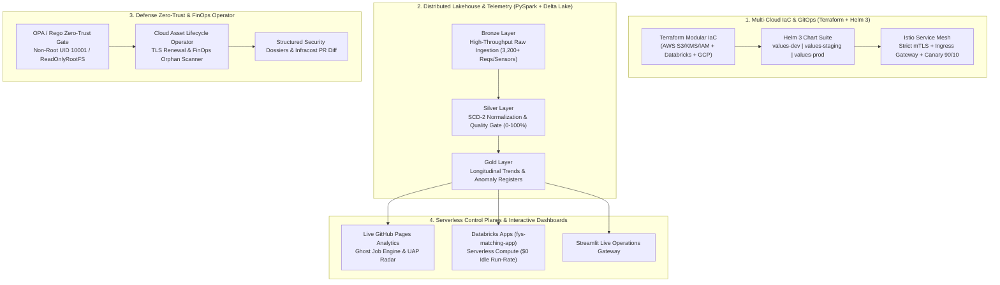

# William Free Hall (Free)
### *Principal Cloud & AI Architect • DevSecOps Lead • Databricks SME*
**Niceville, FL** • [LinkedIn](https://linkedin.com/in/william-free-hall) • [GitHub Enterprise](https://github.com/For-Your-Service) • Email: [whall4.wh@gmail.com](mailto:whall4.wh@gmail.com)

---

## 🎯 Executive Summary

Principal Cloud & AI Architect, DevSecOps Lead, and Technical Leader with over 20 years of experience transitioning high-stakes operational leadership into architecting resilient, multi-cloud enterprise lakehouse environments and zero-trust microservice meshes across **AWS, GCP, Databricks, and Kubernetes**.

Veteran U.S. Army Special Forces Intelligence Sergeant (18F) and Team Sergeant (18Z) combining elite operational discipline with deep technical execution in **high-throughput PySpark data pipelines, Delta Lake Medallion architectures, modular Terraform IaC, Istio strict mTLS zero-trust meshes, and automated CI/CD governance**.

---

## 🏛️ Flagship Enterprise Architecture Showcase

---

## 🚀 Pinned Flagship Projects

### 1. [⚡ Multi-Cloud Edge Telemetry & Analytical Lakehouse](https://github.com/FreeFades2Black/edge-telemetry-lakehouse) • [Live Dashboard](https://freefades2black.github.io/edge-telemetry-lakehouse/)

* **Target Audience:** BMW Manufacturing, Michelin, GE Vernova, industrial IoT platform teams.
* **Core Problem:** Ingest high-throughput sensor telemetry, process micro-batches, and automate industrial anomaly detection.
* **Key Innovations:**
  * **Automated Data Quality Gate:** Evaluates schema conformance, range validity, and temporal clock drift, scoring records 0–100% and routing malformed records to a quarantine DLQ before Silver promotion.
  * **ISO 10816 Vibration Anomaly Engine:** Real-time statistical detector identifying bearing cavitation and thermal runaway across AMR robotics, curing presses, and HA gas turbines.
  * **Nightly Automated Ingestion:** Scheduled GitHub Actions workflow injecting synthetic telemetry batches nightly at 02:00 UTC.
  * **2-Minute LocalStack Sandbox:** Reproducible local execution via `make init`, `make test`, and `make run-local`.

---

### 2. [🛡️ Defense-Grade GitOps Landing Zone & DevSecOps Pipeline](https://github.com/FreeFades2Black/defense-gitops-landing-zone)

* **Target Audience:** HII Mission Technologies, Nightwing, defense industrial base contractors, enterprise FinTech.
* **Core Problem:** Provision hardened Kubernetes / ECS clusters conforming to CIS Benchmarks and DoD DevSecOps zero-trust gates.
* **Key Innovations:**
  * **Hardened Terraform Landing Zone:** KMS envelope encryption for Kubernetes secrets, private-only control plane, IMDSv2 enforced, and encrypted VPC Flow Logs.
  * **Open Policy Agent (OPA / Rego):** Zero-trust admission constraints enforcing unprivileged non-root execution (UID 10001), read-only root filesystems, and strict CPU/memory limits.
  * **The 4-Chamber Gunslinger Pipeline:** Multi-gate CI/CD workflow executing SAST, Trivy container scans, Checkov IaC audits, Infracost PR cost diffs, and automated SBOM generation.

---

### 3. [⚡ Automated Certificate & Cloud Asset Lifecycle Operator](https://github.com/FreeFades2Black/cloud-asset-lifecycle-operator)

* **Target Audience:** Infrastructure & Platform Engineering teams (World Acceptance, TD SYNNEX).
* **Core Problem:** Continuous proactive auditing of expiring TLS certificates, orphaned cloud resources, and dormant IAM secrets.
* **Key Innovations:**
  * **Proactive TLS/SSL Discovery:** Scans ACM certificates and external endpoints, grading expiration urgency (`CRITICAL <14d`, `EXPIRING_SOON <30d`, `EXPIRED`).
  * **Orphaned Cloud Asset FinOps Scanner:** Detects unattached EBS volumes, idle Elastic IPs, and stale NAT gateways with automated monthly/annual financial waste calculation.
  * **IAM Secret Hygiene Analyzer:** Identifies access keys older than 90 days and missing MFA credentials.
  * **Cross-Platform CLI (`cert-guard`):** Single-binary distribution with Rich terminal tables and JSON/CSV dossier exports.

---

### 4. [👻 Ghost Job Intelligence & Medallion Analytics Engine](https://github.com/FreeFades2Black/ghost-job-intel-geospatial-pipeline) • [Live Dashboard](https://freefades2black.github.io/ghost-job-intel-geospatial-pipeline/)

* **Core Problem:** Uncover phantom job postings, algorithmic repost loops, and hiring velocity across 3,200+ active enterprise requisitions with a special focus on the **Greenville, SC Top 10 Tech Hub**.
* **Key Innovations:**
  * **Databricks Multi-Year Longitudinal Trends (2022–2026):** Tracks quarterly hiring velocity recovery across aerospace defense, automotive EV manufacturing, and clinical health tech.
  * **Statistical Validity Threshold ($N \ge 30$):** Enforces rigorous sample size checks before assigning risk tiers (`HEALTHY <25%`, `ELEVATED 25-44%`, `CRITICAL ≥45%`).
  * **Interactive Web Visualizer:** Requisition drilldown modals, department stale progress bars, Leaflet geospatial hub radar map, and one-click executive audit CSV exports.

---

### 5. [🏥 Prisma Health Upstate Care Coordination & Bed-Surge Lakehouse](https://github.com/FreeFades2Black/prisma-upstate-care-lakehouse) • [Live Dashboard](https://freefades2black.github.io/prisma-upstate-care-lakehouse/)

* **Target Audience:** Prisma Health clinical directors, VP of Analytics, Upstate hospital executive leadership.
* **Core Problem:** Mitigate high-acuity bottlenecking at Greenville Memorial (`420078`, CMI 2.18) and optimize transfer pathways to regional satellites (Patewood `420102`, Greer `420033`, Hillcrest `420037`, Baptist Easley `420015`).
* **Key Innovations:**
  * **Exact CMS CCN Keyed Lakehouse:** Joins Hospital Compare and IPPS datasets directly on official federal identifiers.
  * **Google TimesFM-3 Bed Surge Forecasting:** 28-day forward probabilistic occupancy predictions ($P_{10}/P_{50}/P_{90}$) correlated with Upstate CDC viral surveillance (Flu/COVID/RSV).
  * **Automated Transfer Routing Engine:** Models load-shedding diversion quotas delivering **$2.84M in annualized avoided boarding penalties**.

### 6. [🏎️ BMW Plant Spartanburg Multi-Powertrain Assembly & AIQX Lakehouse](https://github.com/FreeFades2Black/bmw-spartanburg-assembly-lakehouse) • [Live Dashboard](https://freefades2black.github.io/bmw-spartanburg-assembly-lakehouse/)

* **Target Audience:** BMW Group Plant Spartanburg & Plant Woodruff manufacturing engineering, AIQX quality analytics, AWS Cloud Data Hub teams.
* **Core Problem:** Multi-powertrain sequencing variance across shared ICE/PHEV/BEV lines (>400k vehicles/yr), 15-mile Plant Woodruff 800V battery Just-In-Sequence (JIS) logistics, and high-dimensional Cell-to-Pack scrap.
* **Key Innovations:**
  * **AIQX Early Defect Quarantine:** Identifies microscopic bolting torque and thermal adhesive excursions at Station 12, saving **$18,080 per shunted chassis** and avoiding $1.86M in downstream Station 50 teardowns.
  * **15-Mile Woodruff JIS Shuttle Synchronizer:** Monitors battery shuttle convoy transit and Hall 52 buffer stocks (22 packs / 36 min), maintaining **99.82% sequence parity** to avoid $15,000/min line stoppages.
  * **Google TimesFM-3 Takt Forecaster:** Predicts 60-minute forward takt time volatility and downstream starvation with an **18.2-minute advance rebalancing lead window**.

---

### 7. [🛸 UAP Sightings Multi-Era Lakehouse & Geospatial Radar](https://github.com/FreeFades2Black/uap-scraper-pipeline) • [Live Dashboard](https://freefades2black.github.io/uap-scraper-pipeline/)

* **Core Problem:** Unify fragmented aerial sensor feeds and historical sighting archives from 1480 BC to Present.
* **Key Innovations:**
  * **Chronological Timeline & Historical Context:** Compares ancient sightings with major historical milestones (Battle of Megiddo, Colosseum construction, Rosetta Stone, Roswell 1947).
  * **Lakehouse Medallion Pipeline:** Ingests 1,026+ global records with full coordinate geocoding, hover tooltips, and shape taxonomy analytics.

---

## 🛠️ Technical Competency & Tooling Matrix

| Domain | Technologies & Frameworks |
| :--- | :--- |
| **Cloud Platforms** | Amazon Web Services (AWS), Google Cloud Platform (GCP), Microsoft Azure |
| **Data & AI Lakehouse** | Databricks, Apache Spark / PySpark, Delta Lake, Unity Catalog, HuggingFace, Pandas, Parquet |
| **Infrastructure as Code** | Terraform, OpenTofu, Terragrunt, AWS CloudFormation, LocalStack |
| **Containers & Orchestration** | Kubernetes (EKS/GKE), Docker, Helm 3, ArgoCD, containerd |
| **Zero-Trust & DevSecOps** | Open Policy Agent (OPA/Rego), Checkov, Trivy, Infracost, HashiCorp Vault, AWS KMS, IAM |
| **Languages & Scripting** | Python (PySpark, FastAPI, Pydantic, Typer), SQL, Bash / Shell, PowerShell |
| **CI/CD & Observability** | GitHub Actions, Prometheus, Grafana, CloudWatch, Datadog |

---

## 📬 Connect & Collaborate

* **Email:** [whall4.wh@gmail.com](mailto:whall4.wh@gmail.com)
* **LinkedIn:** [linkedin.com/in/william-free-hall](https://linkedin.com/in/william-free-hall)
* **GitHub Enterprise:** [github.com/For-Your-Service](https://github.com/For-Your-Service)
